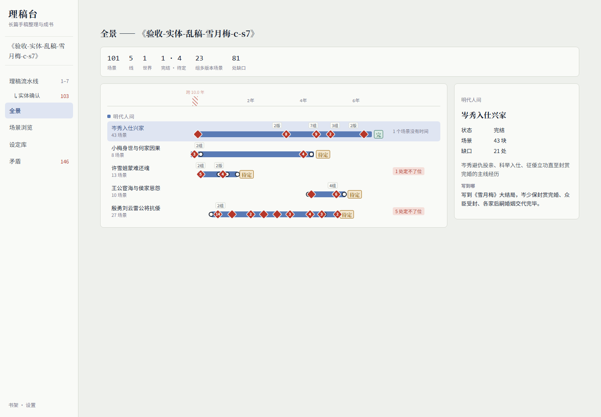

# 理稿台（ligaotai）

把几百万字、乱成一团的长篇手稿，**理清 → 取舍 → 补写**成一本书的本地工作台。

手稿写了很多年，散在几百个文件里：有章节、有片段、有设定笔记，文件名乱、顺序乱；同一个场景写过好几版；人名前后不统一；还有好几条没写完的支线。任何 AI 的上下文都装不下全书，所以没法直接让 AI 帮忙成书。市面上的写作工具都假设手上已经是「一本章节有序的书」，缺「理乱稿」这一层，理稿台补的就是这一层。



**第一次用请看 [使用说明](docs/使用说明.md)**：怎么装、怎么配 key、流水线每一步做什么、费用参考、准确率和已知局限。

## 它做什么

1. **导入**一个文件夹的 `.txt` / `.md` / `.docx`（UTF-8 / GBK 自动识别），**切成场景**，每块一个永不重排的编号。
2. **查重**：找出同一场写过的几个版本，挑主版本。
3. **场景卡**：每场一张结构化卡片（摘要、人物、地点、时间线索、设定事实、回指）；名字和原文引文都核对过能在原文里找到。
4. **实体合并**：同一个人 / 地点 / 组织的不同叫法归成一组，作者确认。
5. **归线排序**：分世界、分主线和支线、线内排先后（排 5 遍按多数票合并）、支线对齐到主线时间轴、找出提到了却没写的缺口；几千场的长线先分卷再排。
6. **档案 / 矛盾 / 全书地图**：每条线的来龙去脉、每个世界的设定集、全书矛盾清单、全书地图，每句结论都带场景编号；伏笔用模型配对埋下和交代。
7. **时间线检查**（可选）：死了又出场、提前知道后面的事。
8. **取舍和成书**：看板定去留（拖进砍掉时列出会断掉的交汇点、人物、伏笔），程序排出卷章骨架、模型写补写说明，手改后导出 Markdown / 纯文本 / Word / EPUB。

铁律：**AI 产出一律先当草稿，作者确认后才算数。** 作者确认过的东西重跑时原样保留。

思路是分层压缩，AI 一次读不完全书，就把全书压成每层都能装进一次对话的四层：

| 层 | 内容 |
|---|---|
| L0 原文 | 场景块，固定编号，永不修改 |
| L1 场景卡 | 每块一张卡 |
| L2 档案 | 每条线一份档案、每个世界一份设定集 |
| L3 全书地图 | 全书总览 |

## 快速开始

需要 Python 3.11+、[uv](https://docs.astral.sh/uv/)、Node.js（只在第一次构建界面时用），和一个 OpenAI 兼容接口的 key（默认 DeepSeek）。

```bash
uv sync
cd web
npm install
npm run build
cd ..
uv run python -m ligaotai
```

浏览器打开 <http://127.0.0.1:8765/>，到「设置」填 key、点「测试连接」，然后在「书架」建书、导入稿子。服务只监听本机，不对外网开放。

## 准确率和费用

拿打乱的公版书和网文验收（拆成几百个乱命名文件、删章、截断、加别名、植入重写版和人造矛盾）。成绩摘要：

| 项目 | 结果 |
|---|---|
| 查重（《西游记》植入 15 个重写版） | 15 / 15，无误合并 |
| 故事顺序 Kendall τ | 《西游记》≈1.0、《雪月梅传》≈0.89、整本《斗破苍穹》主线≈0.91 |
| 档案矛盾（植入 10 处） | 召回 8–9 / 10，引用编造 0 |
| 时间线检查（植入 5+5 处） | 死了又出场 5 / 5，提前知道 4 / 5；整本斗破报出的冲突约三分之二报对，改判断规则后抽样约四分之三 |

整本《斗破苍穹》（458 万字）完整跑一遍用 DeepSeek 闲时价约 **¥120–130**，其中时间线检查约占一半；200 万字的书粗估 ¥50 上下（没实测）。界面不显示费用估算，实际用量记在每本书的 `book.json`。细节见[使用说明](docs/使用说明.md)第七、九节。

**主要局限**：主线里模型每次都犯的个别错位救不回来；长书分卷重叠时块会归错卷；时间线检查只做了两类、同类事多次时有误报；单人单机；**还没有真作者拿真稿子用过**。完整清单见 [`docs/已知问题与待办.md`](docs/已知问题与待办.md)。

## 开发

```bash
uv run pytest -q                        # 后端测试
cd web && npm test                      # 前端测试（另开终端）
uv run python -m ligaotai               # 后端，http://127.0.0.1:8765/docs 有全部接口
cd web && npm run dev                   # 前端热更新，http://localhost:5173
```

- 发给模型的提示词都在 `prompts/`，纯 Markdown，可以直接改；改了相关缓存会失效、结果判过期。
- 设计文档在 [`docs/superpowers/specs/`](docs/superpowers/specs/)，实施计划在 `docs/superpowers/plans/`，每阶段验收过程在 [`docs/验收记录/`](docs/验收记录/)。
- `tools/` 是验收工具：`scramble.py` 把一本书打乱成乱稿并记下答案，`eval_*.py` 按答案核每一步（查重、实体、归线、档案、骨架、时间线），`probe_book.py` 探模型熟不熟这本书（太熟的书验收分数会偏乐观）。例：

  ```bash
  curl -L -o data/xiyouji-pg23962.txt https://www.gutenberg.org/cache/epub/23962/pg23962.txt
  uv run python tools/scramble.py --src data/xiyouji-pg23962.txt --out data/乱稿-西游记 --seed 7
  uv run python tools/eval_dedup.py --folder data/乱稿-西游记 --key data/乱稿-西游记-答案.json
  ```

## 许可证

[MIT](LICENSE)
